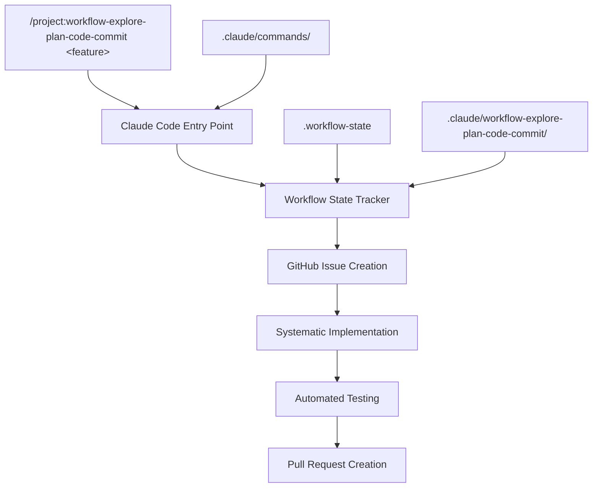

# Systematic Feature Development Workflow

## 🎯 Was ist das Workflow-System?

Dieses Repository nutzt ein **strukturiertes, automatisiertes Workflow-System** für Feature-Entwicklung, das Claude Code's native `/projects` functionality mit ausgeklügeltem State Management und GitHub-Integration kombiniert.

**Warum wurde es entwickelt?**
- ✅ **Konsistenz**: Jedes Feature folgt demselben bewährten Prozess
- ✅ **Nachverfolgbarkeit**: Vollständige Dokumentation und GitHub-Integration  
- ✅ **Qualitätssicherung**: Systematische Tests und Reviews
- ✅ **Automatisierung**: Reduziert manuellen Overhead und Fehlerquellen

---

## 🏗️ System-Architektur



### 📁 Komponenten-Übersicht

| Komponente | Zweck | Speicherort |
|------------|--------|-------------|
| **Entry Point** | `/projects` Slash Command | `.claude/commands/workflow-explore-plan-code-commit.md` |
| **State Tracker** | Workflow-Status & Phase Management | `.claude/workflow-explore-plan-code-commit/workflow-state-tracker.md` |
| **Automation Helpers** | GitHub CLI & Bash Automatisierung | `.claude/workflow-explore-plan-code-commit/workflow-automation-helpers.md` |
| **Quick Reference** | Workflow-Cheatsheet | `.claude/workflow-explore-plan-code-commit/workflow-quick-reference.md` |
| **State File** | Aktueller Workflow-Status | `.workflow-state` |

---

## 🚀 Schnellstart (für Eilige)

**1. Feature starten:**
```
/project:workflow-explore-plan-code-commit "1.4 Service Layer"
```

**2. Den Anweisungen folgen** - das System führt Sie durch:
- ✅ Branch Creation
- ✅ GitHub Issues  
- ✅ Systematic Implementation
- ✅ Testing & Quality Assurance
- ✅ Pull Request Creation

**3. Das war's!** 🎉

> **💡 Tipp**: Das System ist selbsterklärend und gibt bei jedem Schritt klare Anweisungen.

---

## 📋 Detaillierter Workflow-Walkthrough

### Phase 1: Initialisierung

#### 1.1 Workflow starten
```bash
# In Claude Code
/project:workflow-explore-plan-code-commit "1.4 Service Layer"
```

**Was passiert dabei:**
- Der Entry Point in `.claude/commands/` wird ausgeführt
- `$ARGUMENTS` wird durch "1.4 Service Layer" ersetzt
- Workflow State wird initialisiert (`.workflow-state`)
- Feature Branch wird erstellt: `feature/1-4-service-layer`

#### 1.2 Automatische Setup-Verifikation
```bash
# Diese Befehle werden automatisch ausgeführt:
git checkout -b feature/1-4-service-layer
git push -u origin feature/1-4-service-layer  
git status
```

#### 1.3 Exploration Document Creation
Das System erstellt automatisch:
```
1-4-service-layer-exploration.md
```

**Inhalt:**
- 🔍 **Architecture Analysis**: Bestehende Code-Struktur
- 📋 **Requirements Analysis**: Feature-Scope und Acceptance Criteria
- ⚡ **Technical Dependencies**: Integration Points
- 🎯 **Implementation Strategy**: Herangehensweise

### Phase 2: Planning & GitHub Integration

#### 2.1 Issue-basierte Planung
Das System **erstellt automatisch GitHub Issues** basierend auf der Exploration:

```bash
# Beispiel: Service Layer könnte diese Issues generieren:
gh issue create --title "Issue #13: Create GiftSuggestionService with CRUD operations"
gh issue create --title "Issue #14: Implement ConcreteGiftService with business logic"  
gh issue create --title "Issue #15: Add service layer validation and error handling"
gh issue create --title "Issue #16: Create comprehensive service layer unit tests"
```

#### 2.2 State Tracking Update
```bash
# .workflow-state wird aktualisiert:
CURRENT_FEATURE="1.4 Service Layer"
CURRENT_PHASE="PLANNING"
CURRENT_ISSUE="None"
FEATURE_BRANCH="feature/1-4-service-layer"
TOTAL_ISSUES=4
COMPLETED_ISSUES=0
```

### Phase 3: Systematische Implementierung

#### 3.1 Issue-by-Issue Development
Für **jedes GitHub Issue**:

1. **Issue Assignment:**
   ```bash
   gh issue view 13
   # Issue wird als "in progress" markiert
   ```

2. **Implementation:**
   - TDD-Ansatz: Tests zuerst schreiben
   - Code implementieren
   - Tests zum Laufen bringen

3. **Quality Gates:**
   ```bash
   mvn test                    # Unit Tests
   mvn clean compile          # Compilation Check  
   mvn checkstyle:check       # Code Style (falls vorhanden)
   ```

4. **Commit & Issue Closure:**
   ```bash
   git add .
   git commit -m "feat: implement GiftSuggestionService with CRUD operations

   - Add GiftSuggestionService interface
   - Implement basic CRUD operations
   - Add input validation and error handling
   - Include comprehensive unit tests

   Closes #13

   🤖 Generated with [Claude Code](https://claude.ai/code)
   Co-Authored-By: Claude <noreply@anthropic.com>"
   
   gh issue close 13 --comment "✅ Implemented in commit $(git rev-parse HEAD)"
   ```

#### 3.2 Kontinuierliches State Tracking
Nach jedem Issue wird `.workflow-state` aktualisiert:
```bash
COMPLETED_ISSUES=1  # wird inkrementiert
CURRENT_ISSUE="Issue #14"
```

### Phase 4: Testing & Finalization

#### 4.1 Comprehensive Testing
```bash
# Alle Tests ausführen
mvn clean test

# Integration Tests (falls vorhanden)
mvn verify

# Test Coverage Check
mvn jacoco:report
```

#### 4.2 Final Quality Check
```bash
# Build Verification
mvn clean package

# Dependency Check
mvn dependency:analyze

# Final Git Status
git status
git log --oneline origin/main..HEAD
```

### Phase 5: Pull Request Creation

#### 5.1 Remote Sync
```bash
git push origin feature/1-4-service-layer
```

#### 5.2 Automated PR Creation
```bash
gh pr create --title "feat: implement 1.4 Service Layer with comprehensive business logic" --body "$(cat <<'EOF'
## Summary
- ✅ Created GiftSuggestionService with full CRUD operations
- ✅ Implemented ConcreteGiftService with business logic  
- ✅ Added comprehensive validation and error handling
- ✅ Created thorough unit test suite

## Test Plan
- [x] All unit tests pass (mvn test)
- [x] Integration tests verify service layer functionality
- [x] Code coverage meets project standards
- [x] No compilation errors or warnings

## Related Issues
Closes #13, #14, #15, #16

🤖 Generated with [Claude Code](https://claude.ai/code)
EOF
)"
```

---

## 🔧 Komponenten im Detail

### 1. Entry Point (`workflow-explore-plan-code-commit.md`)

**Zweck:** Claude Code `/projects` Integration  
**Funktionen:**
- Entgegennahme von `$ARGUMENTS` (Feature Name)
- Strukturierte Workflow-Phasen  
- Checkpoint-System für Quality Gates
- Integration mit anderen Workflow-Komponenten

**Beispiel Usage:**
```bash
/project:workflow-explore-plan-code-commit "2.1 Repository Layer Enhancement"
```

### 2. State Tracker (`workflow-state-tracker.md`)

**Zweck:** Workflow-Status Management  
**Funktionen:**
- Workflow-Phase Tracking (EXPLORATION → PLANNING → IMPLEMENTATION → FINALIZATION)
- Issue Progress Monitoring 
- Branch Management
- Timestamp Tracking

**State File Beispiel:**
```bash
CURRENT_FEATURE="1.4 Service Layer"
CURRENT_PHASE="IMPLEMENTATION"  
CURRENT_ISSUE="Issue #14"
FEATURE_BRANCH="feature/1-4-service-layer"
TOTAL_ISSUES=4
COMPLETED_ISSUES=2
WORKFLOW_START_TIME="2024-06-13T14:30:00+02:00"
```

### 3. Automation Helpers (`workflow-automation-helpers.md`)

**Zweck:** GitHub CLI & Bash Automatisierung  
**Funktionen:**
- Automated Issue Creation
- Intelligent Commit Message Generation
- PR Template Population
- Git Branch Management

**Key Functions:**
```bash
workflow-create-issues()    # Bulk GitHub Issue Creation
workflow-commit()          # Smart Commit with Issue Linking  
workflow-pr-create()       # Automated PR with Template
```

### 4. Quick Reference (`workflow-quick-reference.md`)

**Zweck:** Workflow-Cheatsheet  
**Inhalte:**
- Phase-spezifische Checklisten
- Häufige Git/GitHub Commands
- Quality Gate Verifications
- Troubleshooting Quick-Fixes

---

## 🛠️ Troubleshooting

### Häufige Probleme & Lösungen

#### Problem: Workflow State ist inkonsistent
```bash
# Lösung: State manuell zurücksetzen
rm .workflow-state
/project:workflow-explore-plan-code-commit "Feature Name"
```

#### Problem: GitHub Issues wurden nicht erstellt
```bash
# Lösung: GitHub CLI Auth prüfen
gh auth status
gh auth login
```

#### Problem: Branch existiert bereits
```bash
# Lösung: Branch cleanup
git branch -D feature/old-feature-name
git push origin --delete feature/old-feature-name
```

#### Problem: Tests schlagen fehl
```bash
# Lösung: Test Environment prüfen  
mvn clean test -X                    # Debug Output
mvn dependency:resolve              # Dependencies prüfen
docker ps                          # TestContainers prüfen
```

### Debug-Modi

#### Workflow State anzeigen
```bash
cat .workflow-state
```

#### GitHub Integration testen
```bash
gh issue list
gh pr list  
gh auth status
```

#### Git Status vollständig
```bash
git status
git branch -vv
git log --oneline origin/main..HEAD
```

---

## ⚡ Erweiterte Nutzung

### Custom Issue Templates

Sie können die automatische Issue-Erstellung anpassen, indem Sie Templates in `.claude/workflow-explore-plan-code-commit/` erstellen:

```markdown
<!-- .claude/workflow-explore-plan-code-commit/issue-template-service.md -->
**Feature**: $FEATURE_NAME
**Component**: Service Layer

## Tasks
- [ ] Create service interface
- [ ] Implement business logic
- [ ] Add validation layer
- [ ] Write comprehensive tests

## Acceptance Criteria
- All unit tests pass
- Code coverage > 80%
- Integration tests verify functionality
```

### Multi-Phase Features

Für große Features können Sie den Workflow in mehrere Phasen aufteilen:

```bash
/project:workflow-explore-plan-code-commit "2.1 API Layer - Phase 1 (Controllers)"
/project:workflow-explore-plan-code-commit "2.1 API Layer - Phase 2 (DTOs)"  
/project:workflow-explore-plan-code-commit "2.1 API Layer - Phase 3 (Documentation)"
```

### Team Integration

Das System ist team-ready:
- `.claude/` Verzeichnis ist versioniert → Team-weite Standards
- GitHub Issues → Transparente Aufgabenverteilung
- PR Templates → Konsistente Code Reviews
- State Tracking → Einfache Übergaben zwischen Entwicklern

---

## 📈 Best Practices

### 1. Feature Naming Convention
```bash
# Gut:
"1.4 Service Layer"
"2.3 Authentication Enhancement"
"3.1 Database Migration"

# Schlecht:  
"fix stuff"
"updates"
"new feature"
```

### 2. Issue Granularität
- **Ein Issue = Ein logischer Arbeitsschritt (1-3 Stunden)**
- **Klare Acceptance Criteria**
- **Testbare Deliverables**

### 3. Commit-Strategie
```bash
# Feature commits folgen conventional commits:
feat: implement GiftSuggestionService with CRUD operations
fix: resolve null pointer exception in ConcreteGiftService  
test: add comprehensive unit tests for service layer
docs: update API documentation for new endpoints
```

### 4. Quality Gates nie überspringen
- ✅ **Tests müssen grün sein** vor dem Commit
- ✅ **Code muss kompilieren** ohne Warnings
- ✅ **Jedes Issue muss abgeschlossen sein** vor dem nächsten

---

## 🎓 Lernpfad für neue Entwickler

### Beginner (Erste Schritte)
1. **Lesen Sie dieses Dokument vollständig**
2. **Schauen Sie sich ein abgeschlossenes Feature an** (z.B. in der Git History)
3. **Starten Sie mit einem kleinen Feature** (1-2 Issues)

### Intermediate (Routine entwickeln)
1. **Nutzen Sie den Workflow für alle Features**
2. **Experimentieren Sie mit Custom Issue Templates**
3. **Optimieren Sie Ihre Quality Gates**

### Advanced (System erweitern)
1. **Entwickeln Sie eigene Automation Helpers**
2. **Erstellen Sie team-spezifische Workflow-Varianten**
3. **Integrieren Sie zusätzliche Tools** (Linting, Security Scans, etc.)

---

## 💡 Tipps & Tricks

### Workflow-Performance optimieren
```bash
# Git Aliases für häufige Befehle
git config alias.wf-status '!cat .workflow-state'
git config alias.wf-log 'log --oneline origin/main..HEAD'
```

### GitHub CLI Power-Features
```bash
# Bulk Issue Operations
gh issue list --state open --json number,title | jq '.[] | .number'

# PR Review Automation  
gh pr review --approve
gh pr merge --squash
```

### Claude Code Integration
```bash
# Custom Commands für wiederkehrende Tasks
# .claude/commands/quick-test.md
mvn clean test -Dtest=$ARGUMENTS
```

---

## 🤝 Contributing zum Workflow-System

Das Workflow-System ist darauf ausgelegt, kontinuierlich verbessert zu werden:

### Feedback & Verbesserungen
- **Issues erstellen** für Workflow-Verbesserungen
- **Pull Requests** für neue Automation Helpers
- **Dokumentation erweitern** basierend auf Team-Erfahrungen

### Erweiterung für andere Projekte
Das System ist **projektunabhängig** und kann leicht auf andere Repositories übertragen werden:

1. **`.claude/` Verzeichnis kopieren**
2. **CLAUDE.md anpassen** für projekt-spezifische Commands
3. **Issue Templates customizen** für andere Tech-Stacks

---

## ❓ FAQ

**Q: Kann ich den Workflow mid-flight ändern?**  
A: Ja, Sie können `.workflow-state` manuell editieren oder Phasen überspringen.

**Q: Was passiert bei Git-Konflikten?**  
A: Der Workflow pausiert automatisch. Lösen Sie Konflikte manuell und setzen Sie fort.

**Q: Kann ich mehrere Features parallel entwickeln?**  
A: Ja, jeder Branch hat seine eigene `.workflow-state`. Checken Sie zwischen Branches um.

**Q: Funktioniert das System ohne GitHub?**  
A: Teilweise. Das Branch- und State-Management funktioniert lokal, aber Issue-Integration nicht.

**Q: Wie integriere ich bestehende Features in das System?**  
A: Starten Sie einen neuen Workflow und migrieren Sie Code schrittweise über Issues.

---

## 📚 Weitere Ressourcen

- **[Claude Code Best Practices](https://www.anthropic.com/engineering/claude-code-best-practices)** - Offizielle Documentation
- **[GitHub CLI Manual](https://cli.github.com/manual/)** - Für erweiterte GitHub-Integration
- **[Conventional Commits](https://www.conventionalcommits.org/)** - Commit Message Standards
- **[Git Workflow Strategies](https://www.atlassian.com/git/tutorials/comparing-workflows)** - Branching Strategies

---

*Dieses Workflow-System wurde entwickelt um sicherzustellen, dass jedes Feature mit derselben Qualität, Dokumentation und Nachverfolgbarkeit entwickelt wird. Es wächst mit Ihrem Team und kann an spezifische Projekt-Anforderungen angepasst werden.*

**Happy Coding! 🚀**